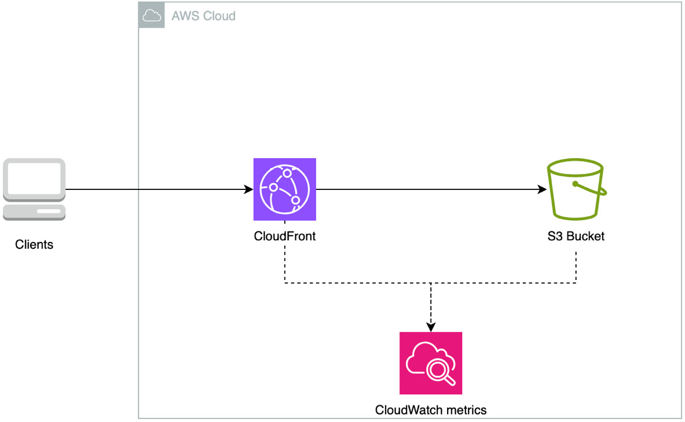
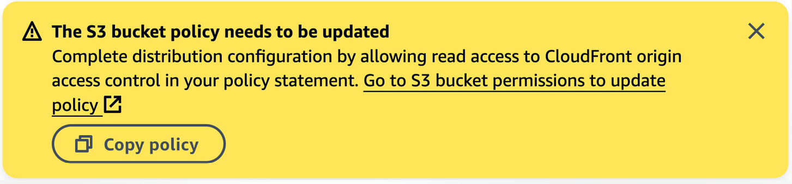
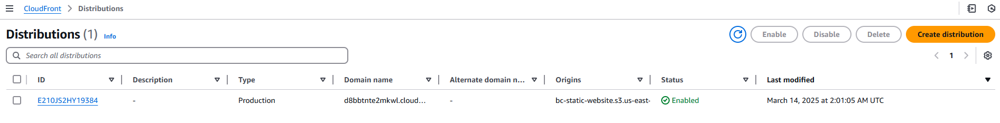
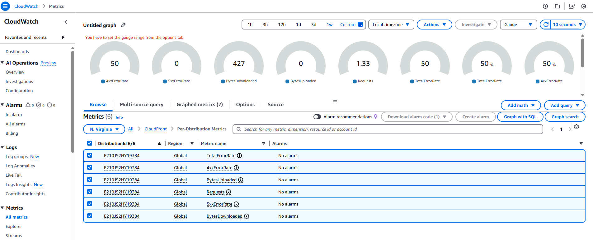

# Creating a Personal Website Using AWS

## Scenario

Imagine you’re a recent graduate or a professional looking to showcase your skills, experience, and accomplishments to potential employers or clients. You want to create an online presence that is easily accessible and professional-looking, where you can share your CV or resume.

## Functional Requirements

- Ability to create, edit, and update the content of the CV, including sections for personal information, education, work experience, skills, and projects.
- Support for non-text content such as images.
- Accessible on any browser over the internet.
- Ability to generate insights based on website data.

## Non-Functional Requirements

- **Low latency** – fast page load times.
- **High availability** – available when accessed.
- **Ease of maintainability** – easy process to update and patch the website.
- **Low cost** – affordable pay-as-you-go services.

## Architecture

The website will be hosted on AWS using the following components:

- **Amazon S3**: Stores static website files (index.html, index.css, avatar.png).
- **Amazon CloudFront**: Speeds up content delivery by caching static files closer to users.
- **Amazon CloudWatch**: Monitors website performance and user interactions.

## AWS Services Overview

### Amazon S3

Amazon Simple Storage Service (S3) is an object storage service that offers high scalability, availability, security, and performance.

- **Highly Available**: Ensures that website files (HTML, CSS, images) are always accessible.
- **Fully Managed**: No need for OS patching or maintenance.
- **Supports Versioning**: Easily update and roll back CV versions.
- **Cost-Effective**: Pay-as-you-go model with a free tier.

### Amazon CloudFront

CloudFront is a content delivery network (CDN) that speeds up distribution of static and dynamic content by caching files at edge locations worldwide.

- **Global Accessibility**: Users get fast access regardless of location or device.
- **Enhanced Availability**: Prevents single points of failure.
- **Cost Efficiency**: Reduces data transfer costs with compression and caching.

### Amazon CloudWatch

CloudWatch provides real-time monitoring for AWS resources and applications.

- **Tracks Website Performance**: Logs metrics such as requests, errors, and data usage.
- **User Insights**: Helps analyze visitor activity.
- **Automated Alerts**: Sends notifications based on thresholds.

## Deployment Steps

### 1. Create an S3 Bucket

- Go to the AWS S3 console.
- Create a new bucket with a unique name.
- Upload `index.html`, `index.css`, and `avatar.png`.

### 2. Configure CloudFront

- Navigate to the CloudFront console.
- Create a new distribution and select the S3 bucket as the origin.
- Change origin access to **Origin Access Control (OAC)**.
- Under the Web Application Firewall (WAF) section, do not enable the security protections.
- Navigate to your CloudFront distribution and select Edit under Settings. In the Default root object field, insert index.html and save your changes.

### 3. Update S3 Bucket Policy

- When you create the distribution, a yellow popup will appear at the top of your screen.

- Select "Copy policy."

- Click "Go to S3 bucket permissions" to update the policy.

- In the S3 console, navigate to the bucket permissions.

- Edit the bucket policy and paste the copied policy from CloudFront.

- Save the changes.

When the distribution finishes propagating your changes, the status column shows the Enabled status, and the Last modified column shows a date as shown

### 4. Access the Website

- Open your CloudFront distribution URL: `https://your-cloudfront-id.cloudfront.net/`.

### 5. Monitoring the Website

Your website is online, you can share the URL with other people and they will always have access to your latest CV. However, how do you know whether they actually accessed it, or whether they are having a good experience?
You already know the answer; it’s CloudWatch metrics:

- Navigate to the CloudWatch metrics console (https://us-east-1.console.aws.amazon.com/cloudwatch/home?region=us-east-1#metricsV2)

- In the Browse tab, you will find all kinds of AWS services. Select CloudFront, followed by Per-Distribution Metrics.

- If you have more than one distribution, you will need to identify the relevant one by ID. If you just have one, select BytesDownloaded, Requests, 5xxErrorRate, and 4xxErrorRate.

By following these steps, you have successfully deployed a static website using AWS!
