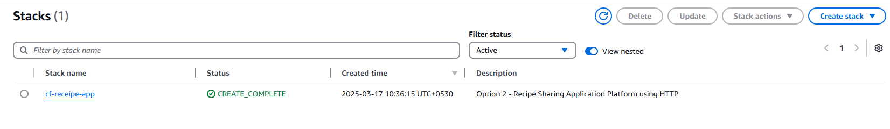

# Deploy a Dynamic Website Using AWS

## Scenario

In this project, you want to develop a recipe-sharing application to provide a convenient platform for people to discover, share, and access different recipes. this application will need to handle dynamic content inherent to recipe management. There are different key personas that will access your application:

- Platform admin: The platform owner, who may want to create a new recipe, maintain it, or even delete it.

- End users/consumers: The end user, who uses the platform for accessing a specific recipe, and should not be able to create, change, or delete any record.

## Functional Requirements

This application is designed to serve two different user profiles: **admins** and **end users**. To accommodate these personas, the initial project will have two distinct pages:

- `/user` for the end users
- `/admin` for the admins

The goal is to create a seamless experience with a simple and intuitive UI. Additionally, the application should be fully responsive, ensuring compatibility across different devices, including tablets, mobile phones, and laptops.

## Non-Functional Requirements

The application must efficiently handle **spiky access patterns** due to expected utilization increases near meal times. Additionally, expansion into the European market is planned in the coming months, necessitating global availability. Cost-effectiveness is a priority, as there is currently no revenue stream from the application.

To meet these needs, the application must incorporate:

- **Global distribution** to serve a geographically dispersed user base.
- **Auto-scaling** to accommodate fluctuating traffic patterns.
- **Cost-effectiveness** to ensure sustainability without a direct income stream.

## Technical Requirements

The application will be built using a **modern web framework** that is highly performant, user-friendly, and lightweight. The technology stack includes:

- **Frontend:** React.js
- **Backend Programming Language:** Python
- **API Framework:** FastAPI

## Data Requirements

The application primarily manages **recipes**, and the data will be stored as individual documents with no relational dependencies. The system will not require complex queries; instead, it will support basic operations, including:

- **Listing recipes:** Display a list of all created recipes.
- **Deleting recipes:** Allow admins to remove recipes that are no longer needed.
- **Creating recipes:** Enable users to add new recipes to the platform.

This structure ensures a lightweight and efficient data model, supporting the application's objectives while maintaining simplicity and scalability.

## Architecture

Designing your API is crucial to ensure you use the right model to perform all the data operations you will need, and both data and functional requirements should be taken into consideration.


Here’s the breakdown:

- GET /recipes: This gets the list of recipes.
- GET /health: This is a simple health check endpoint.
- DELETE /recipes/{recipe_id}: This deletes a specific recipe with a defined ID.
- POST /recipes: This creates a new recipe record.

**AWS architecture for the recipe-sharing application**


## AWS Services

### Amazon S3

S3 is a scalable, highly available, and durable object storage service provided by AWS, and overall, a cost-effective solution for hosting static websites, including SPAs.

### Amazon CloudFront

You plan for your application to serve users globally and want to ensure a secure access protocol with HTTPS not supported in S3.

### Amazon Virtual Private Cloud (VPC)

Amazon VPC allows you to create a logically isolated virtual network in the AWS cloud. It enables you to define a virtual networking environment where you can launch and manage AWS resources, such as Amazon Elastic Compute Cloud (EC2) instances, in a secure and controlled manner. As part of the VPC configuration, you can define your network topology with multiple subnets, which can be public or private, meaning with or without internet access, respectively, to segregate your traffic and increase the security posture.

### Amazon EC2

EC2 offers a wide range of instance types with different configurations of CPU, memory, storage, and networking capacity, allowing you to choose the right instance type for your specific application requirements, ensuring optimal performance and cost-effectiveness.

### Application Load Balancer (ALB)

An ALB is a fully managed load-balancing solution designed to distribute traffic across multiple targets, namely EC2 instances. Being a managed solution, it is highly scalable by design and automatically scales according to the traffic load. Moreover, and considering your requirements, ALB brings two main advantages:

- Health checking: Every load balancer needs to have at least one target group, and you can configure health checks to your targets to ensure traffic is only sent to healthy targets, avoiding a bad user experience and increasing the resilience and fault-tolerance levels of your application.
- SSL termination: ALBs support SSL termination, offloading the computational burden of encryption and decryption from your EC2 instances.

### Amazon DynamoDB

Amazon DynamoDB is a fully managed NoSQL database service, more specifically a key-value and document store that delivers single-digit millisecond performance at any scale. By choosing DynamoDB, you will leverage the native high availability due to data replication performed under the hood with a pay-as-you-go model and automatic scaling to handle spiky workloads, like the case of your application.

### AWS CloudFormation

CloudFormation is an Infrastructure as Code (IaC) service that allows you to define and provision AWS resources in a declarative way, described as template documents that can be written either in YAML or JSON. Like any IaC tool, CloudFormation enables infrastructure automation in its life cycle, from creation and update to deletion. It supports drift detection to identify any changes that may be performed outside the template, which can cause inconsistencies. Making manual changes to resources managed by CloudFormation is not recommended because it can result in configuration drift, where the actual state of the resources differs from what is defined in the template.

## Coding the solution

Inside the this repository folder, you will find three subfolders.
frontend: This contains the code for your frontend
backend: This contains the code for your API
platform: This contains two different CloudFormation templates to deploy the main infrastructure for your application

## Solution deployment

To proceed with stack creation, follow these steps:

- Click on Create Stack.
- In the Prerequisite – Prepare Template section, select Choose an existing template.
- In the Specify Template section, choose Upload a template file.
- Click on Choose file.
- Select the template from the chapter3/code/platform folder according to the option you are following.
- Click Next.


The resources for your application are now being provisioned. You need to wait until the stack status changes to CREATE_COMPLETE.


## Frontend configuration and deployment

Navigate to the …/frontend/src/configs/configs.tsx file within the project folder, where the configuration file is located.
			The config file is composed of seven configuration variables:
			
				CONFIG_MAX_INGREDIENTS: Max ingredients in a recipe
				CONFIG_MAX_STEPS: Max steps in a recipe
				CONFIG_MAX_RECIPES: Max recipes supported
				CONFIG_USER_PAGE_TITLE: Title for user page
				CONFIG_ADMIN_PAGE_TITLE: Title for admin page
				CONFIG_appConfig: Object with page title and icon (icons in /frontend/public/)
				API_URL: API endpoint

All the configs besides API_URL are optional and serve solely to apply small application customizations, so we will focus now on the API endpoint configuration. API_URL, as the name suggests, is the endpoint used to send requests, and depending on the option you are following, you need to get this value from different places.

The protocol used to access your API is HTTP. So, in this case, you need to provide the EC2 public DNS.

After setting the API_URL config, you can save the file and proceed to the build process, which involves several steps to convert the code into a production-ready bundle that can be served to web browsers. In our example, we used npm as the package manager, so you need to run the following command:
			
`npm install && npm run build`			

The result is a folder with the files needed to be copied to our S3 buckets. The folder name may vary but it is typically build/ or dist/ and is created at the frontend root

Locate the S3 bucket:

- First, you need to find the S3 bucket that you created earlier using the CloudFormation template. The name of the bucket should start with frontend-chapter-3- followed by a random string of characters (e.g., frontend-). Click on its name to open it.

- Add files from the dist folder.

- Inside the S3 bucket, click on the Upload button. This will allow you to upload files from your local machine to the S3 bucket.
				Add the necessary content to the bucket:First click on Add Files, locate the dist folder on your local machine, select all the files inside the folder, and confirm. Next, on the S3 console, click on Add folder, locate the dist folder on your local machine, select the assets folder, and confirm.
			
Optionally, you can just drag the content to the S3 window, but despite the method you use, your S3 upload window should look like


### Testing and exploring the backend

 you need to use different URLs for testing and the value you’ve used for the API_URL parameter in the config.tsx file you updated in the previous section. To test your API, you can send a request to one of the endpoints, and if everything is working properly, you should get a response and a success status code.

 In the following code, you can see an example of a curl command issued to our API endpoint at the /recipes route to get the list of recipes created:
			
$ curl -i 'http://ec2-18-224-34-102.us-east-2.compute.amazonaws.com/recipes'


```
HTTP/2 200
date: Wed, 03 Apr 2024 16:06:15 GMT
contente-type: application/json
contente-length: 2
server: nginx/1.18.0 (Ubuntu)
[]
```
### Testing and exploring the frontend
To access your frontend, you need to do the following:
			
- Go to the CloudFront console.
- Select the distribution you created with the CloudFormation stack. (If you have more than one distribution and you are not sure which one is the one created by the stack, open the CloudFormation service, go to the stack you created earlier, and check the output value for CloudFrontDistributionId.)
- Copy the URL of the distribution (it should follow the structure https://XXXXXX.cloudfront.net/).

### Testing and exploring your DynamoDB table

The last part to test is the integration between your API and your data layer in DynamoDB, where your recipe data is stored.

## Cleaning up

AWS resources incur costs. Although most services initially fall under the free tier, eventually that runs out, and you will incur costs. We recommend that you delete every application after you are done playing with it.

#### By following these steps, you have successfully deployed a dynamic website using AWS!
